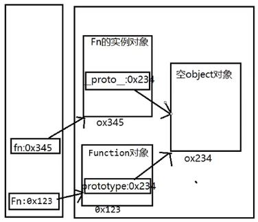
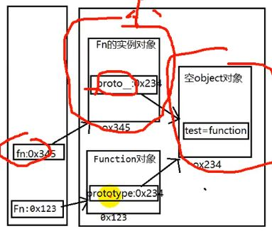
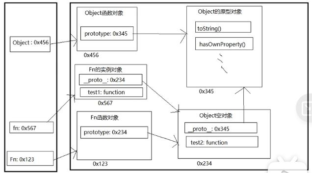
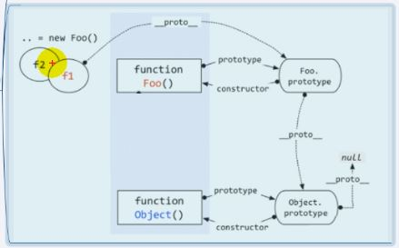
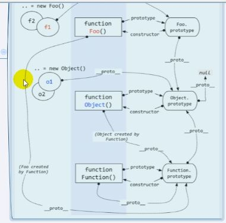

# 原型与原型链
## 函数的 prototype 属性
+ 每个函数都有一个 prototype 属性，默认指向一个 object 空对象
+ 原型对象中有一个属性 constructor，指向函数对象
+ 给原型对象添加属性（一般是方法），实例对象可以访问
+ 作用：函数的所有实例对象，自动拥有原型中的属性（方法） 
```javascript
console.log(Date.prototype, typeof Date.prototype)

console.log(Date.prototype.constructor === Date) // 原型对象中有一个属性 constructor，指向函数对象
function fun () {

}

console.log(fun.prototype)  // 默认指向一个空的 Object 空对象
console.log(fun.prototype.constructor === test)
fun.prototype.test = function() { // 给原型对象添加方法
    console.log('test')
}
``` 
## 显式原型与隐式原型
+ 每个函数 function 都有一个 prototype，即显式原型（属性）
+ 每个实例对象都有一个 \_\_proto__ ，即为隐式原型
+ 对象的隐式原型的值为其对应构造函数的显式原型的值
+ 内存结构
+ 总结
>+
```javascript
function Fn () {
}  // 相当于 this.prototype = {}
var fn = new Fn() // 相当于 this.__proto__ = Fn.prototype

// 每个函数 function 都有一个 prototype，即显式原型（属性）
console.log(Fn.prototype)  
// 每个实例对象都有一个 \_\_proto__ ，即为隐式原型
console.log(fn.__proto__)
// 对象的隐式原型的值为其对应构造函数的显式原型的值
console.log(Fn.prototype === fn.__proto__) // true

Fn.prototype.test = function () {
    console.log('test')
}
fn.test()
``` 



## 原型链
+ 访问一个对象的属性时：
>+ 先在自身属性中查找，找到后返回
>+ 如果没有，再沿着\_\_proto__这条链路向上查找，找到后再返回
>+ 如果最终没有找到，返回undefined
+ 别名：隐式原型链
+ 作用：查找对象的属性（方法）
### 构造函数/原型/实体对象的关系（图解）
### 构造函数/原型/实体对象的关系2（图解）
```javascript

function Fn() {
    this.test1 = function() {
        console.log('test1()')
    }
}
Fn.prototype.test2 = function () {
    console.log('test2()')
}
var fn = new Fn()
fn.test1()
fn.test2()
console.log(fn.toString())  // [object Object]
console.log(fn.test3())  // undefined Uncaught TypeError: fn.test3 is not a function
``` 


+ 所有的函数都有两个属性：prototype 和 \_\_proto__
```javascript

function Fn() {
    
}  // 相当于下面那行代码, 因此fn也是Function的实例对象，也具有__proto__属性
// 所有的函数都有两个属性：prototype 和 __proto__

var Foo = new Function()

``` 
### 补充
+ 函数的显式原型：默认指的是空的Object实例对象（但Object不满足）
```javascript
console.log(Fn.prototype instanceof Object)  // true
console.log(Object.prototype instanceof Object)  // false
console.log(Function.prototype instanceof Object) // true
```  
+ 所有的函数都是Function 的实例（包含Function)
```javascript
console.log(Function.__proto__ === Function.prototype) // true
```   
+ Object 的原型对象是原型链尽头
```javascript
console.log(Object.prototype.__proto__) // null
```   
### 原型继承
+ 构造函数的实例对象自动拥有构造函数原型对象的属性（方法）
+ 利用的是原型链

### 原型链属性
+ 读取对象的属性值时，会自动到原型链中查找
+ 设置对象的属性值时，不会查找原型链，如果当前对象没有该属性，则自动为其添加该属性并赋值
+ 方法一般定义在原型中，属性一般通过构造函数定义在对象本身上

### 探索 instanceof
+ 判断左边的对象，是否是右边的实例
+ instanceof 是如何判断的？
>+ 表达式 A instanceof B
>+ 如果 B 的显式原型对象在 A 的原型链上，则返回 true
```javascript
function Foo() {}
var f1 = new Foo()
console.log(f1 instanceof Foo)  // true
console.log(f1 instanceof Object)  //true
```

```javascript

console.log(Object instanceof Function)  // true
console.log(Object instanceof Object)  // true
console.log(Function instanceof Function)  // true
console.log(Function instanceof Object)  // true

function Foo() {
    console.log(Object instanceof Foo)  // false
}
```

 
 ### 面试题
 ```javascript
function A () {
}
A.prototype.n = 1
var b = new A()
A.prototype = {
    n: 2,
    m: 3
}
var c = new A()
console.log(b.n, b.m, c.n, c.m) // 1 undefined 2 3
```

 ```javascript
function F () {
}
Object.prototype.a = function() {
    console.log('a()')
}
Function.prototype.b = function() {
    console.log('b()')
}
var f = new F()
f.a() // a()
f.b() // undefined
F.a() // a()
F.a() // b()
```