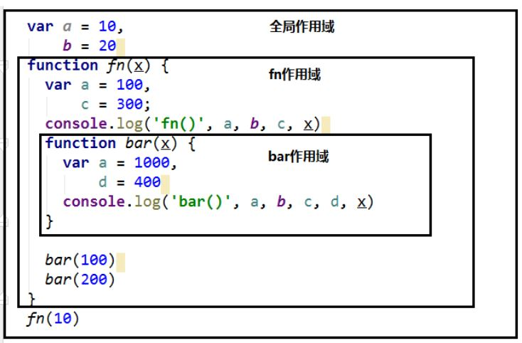
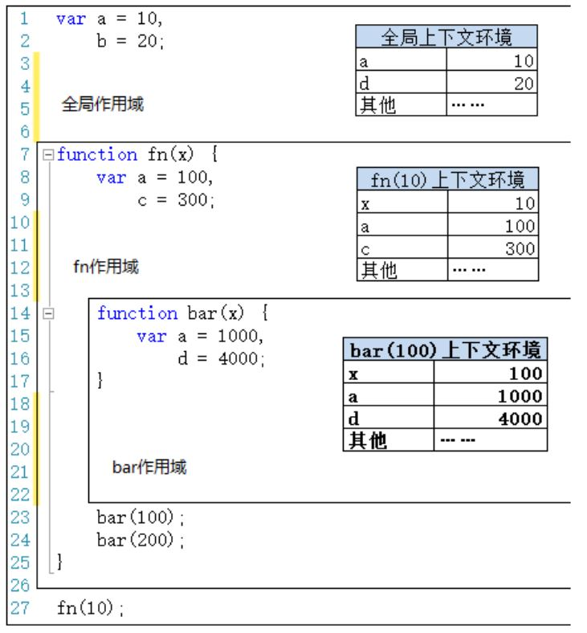

# 作用域与作用域链

## 作用域

### 理解

- 相当于一块地盘，一个代码所在的区域
- 是静态的（相对于上下文对象），在编写代码时就确定了

### 分类

- 全局作用域
- 函数作用域
- ES6 有块作用域，之前没有

```javascript
// 之前没有块作用域
if (true) {
  var a = 3;
}
console.log(a); // 3
// es6 块作用域
if (true) {
  let b = 4;
}
console.log(b); // undefined
```

### 作用

- 隔离变量，避免不同作用域下的同名变量冲突

```javascript
var a = 10;
var b = 20;
function fn(x) {
  var a = 100;
  var c = 300;
  console.log("fn()", a, b, c, x);
  function bar(x) {
    var a = 1000;
    var d = 400;
    console.log("bar()", a, b, c, d, x);
  }
  bar(100);
  bar(200);
}
fn(10);
```



## 作用域与执行上下文



### 区别一

- 全局作用域之外，每个函数都会创建自己的作用域，作用域在函数定义时就已经确定了，而不是在函数调用时
- 全局执行上下文环境实在全局作用域确定之后，JS 代码马上执行之前创建
- 函数执行上下文是在调用函数时，函数体代码执行之前创建

### 区别二

- 作用域是静态的，只要函数定义好了就一直存在，且不会再变化
- 执行上下文环境是动态的，调用函数时创建，函数调用结束时，上下文环境就会被自动释放

### 联系

- 执行上下文环境（对象）是从属于所在的作用域
- 全局上下文环境 ==> 全局作用域
- 函数上下文环境 ==> 对应的函数使用域

## 作用域链

### 先在当前作用域里找，找不到再去外部找

### 当查找到全局作用域还没有时，便会抛出找不到的异常
