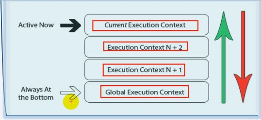
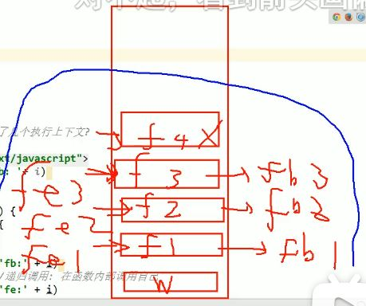

# 执行上下文
## 代码分类
+ 全局代码
+ 函数（局部）代码
### 全局执行上下文
+ 在执行全局代码前，将window确定为全局执行上下文
+ 对全局数据进行预处理
>+ var 定义的全局变量 ==> undefined，添加为 window 的属性
>+ function 声明的全局函数 ==> 赋值（fun)，添加为 window 的方法
>+ this ==> 赋值（window）
+ 开始执行全局代码
### 函数执行上下文
+ 在调用函数，准备执行函数体之前，创建对应的函数执行上下文对象
+ 对局部数据进行预处理
>+ 形参变量 ==> 赋值（实参） ==> 添加为执行上下文的属性
>+ arguments ==> 赋值（实参列表），添加为执行上下文的属性
>+ var 定义的局部变量 ==> undefined，添加为执行上下文的属性
>+ function声明的函数 ==> 赋值(fun)，添加为执行上下文的方法
>+ this ==> 赋值（调用函数的对象）
+ 开始执行函数体代码
  
```javascript
// 函数执行上下文
function fn (a1) {
    console.log(a1) // 2
    console.log(a2) // undefined
    a3()  // a3()
    console.log(this) //window
    console.log(arguments) // 伪数组 2, 3
    var a2 = 3
    function a3 () {
        console.log('a3()')
    }
}
fn(2, 3)
```
## 执行上下文栈
+ 在全局代码执行之前，JS引擎会创建一个栈，来存储管理所有的执行上下文对象
+ 在全局执行上下文（window）确定后，将其添加到栈中（压栈）
+ 在函数执行上下文创建后，将其添加到栈中（压栈）
+ 在当前函数执行完毕后，将栈顶的对象移除（出栈）
+ 当所有的代码执行完后，栈中只剩下window
```javascript
var a = 10
var bar = function (x) {
    var b = 5
    foo(x + b)
}
var foo = function (y) {
    var c = 5
    console.log(a + c + y)
}
bar(10)
```


## 面试题
+ 依次输出什么？
+ 整个过程中产生了几个执行上下文？(5个)
 ```javascript
console.log('global begin: ' + i)
var i = 1
foo(1)
function foo(i) {
    if (i == 4) {
        return
    }
    console.log('foo() begin: ' + i)
    foo(i + 1)
    console.log('foo() end:' + i)
}
console.log('global end: ' + i)

// global begin: undefined 
// foo() begin: 1 
// foo() begin: 2 
// foo() begin: 3 
// foo() end:3 
// foo() end:2 
// foo() end:1 
// global end: 1
```

+ 下面代码输出什么？（function）
>+ 先执行变量提升，后执行函数提升
```javascript
function a() {}
var a
console.log(typeof a) // function
```
+ 下面代码输出什么？（undefined）
```javascript
if (!(b in window)) {
    var b = 1
}
console.log(b)  // undefined
```
+ 下面代码输出什么？（c is not a function）
>+ 先执行变量提升，后执行函数提升，然后变量赋值
```javascript
var c =1
function c(c) {
    console.log(c)
}
c(2)  // 报错
```
>+ 等价于下一段代码
```javascript
var c 
function c(c) {
    console.log(c)
}
c = 1
c(2)  // 报错
```