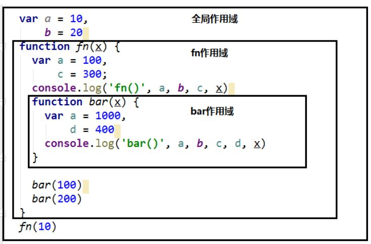

# 作用域与作用域链
## 作用域
### 理解
+ 相当于一块地盘，一个代码所在的区域
+ 是静态的（相对于上下文对象），在编写代码时就确定了
### 分类
+ 全局作用域
+ 函数作用域
+ ES6 有块作用域，之前没有
```javascript
// 之前没有块作用域
if (true) {
    var a = 3
}
console.log(a) // 3
// es6 块作用域
if (true) {
    let b = 4
}
console.log(b) // undefined
```
### 作用
+ 隔离变量，避免不同作用域下的同名变量冲突
```javascript
var a = 10
var b = 20
function fn(x) {
    var a = 100
    var c = 300
    console.log('fn()', a, b, c, x)
    function bar(x) {
        var a = 1000
        var d = 400
        console.log('bar()', a, b, c, d, x)
    }
    bar(100)
    bar(200)
}
fn(10)
```

## 作用域与执行上下文

### 区别一
+ 全局作用域之外，每个函数都会创建自己的作用域，作用域在函数定义时就已经确定了，而不是在函数调用时
+ 全局执行上下文环境实在全局作用域确定之后，JS代码马上执行之前创建
+ 函数执行上下文实在调用函数时，函数体代码执行之前创建
### 区别二
+ 作用域是静态的，只要函数定义好了就一直存在，且不会再变化
+ 执行上下文环境是动态的，调用函数时创建，函数调用结束时，上下文环境就会被自动释放
### 联系
+ 执行上下文环境（对象）是从属于所在的作用域
+ 全局上下文环境 ==> 全局作用域
+ 函数上下文环境 ==> 对应的函数使用域

## 作用域链
### 先在当前作用域里找，找不到再去外部找
### 当查找到全局作用域还没有时，便会抛出找不到的异常
