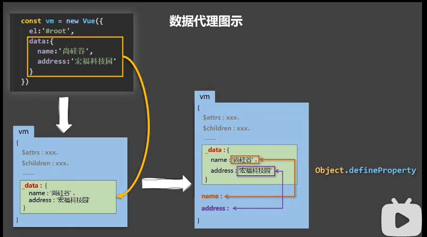

b# Vue 模板语法
## 两大类
+ 1.插值语法
>+ 功能：用于解析标签体内容
>+ 写法：{{ xxx }}，xxx 是js表达式，且可以直接读取到data中的所有属性
+ 2.指令语法
>+ 功能：用于解析标签（包括：标签属性、标签体内容、绑定事件···）
>+ 举例：v-bind:href="xxx" 或者简写为 :href="xxx"，xxx 同样要写js表达式，且可以直接读取到data中的所有属性
>+ 备注：Vue中有很多指令，且形式都是 v-???

## 数据绑定
+ 单向数据绑定
>+ v-bind
```html
<input type="text" v-bind:value="name"></br>
<input type="text" :value="name"></br>
```
+ 双向数据绑定
>+ v-model
```html
<input type="text" v-model:value="name"></br>
<input type="text" v-model="name"></br>
```
>+ 页面中的数据发生改变，则vue中的数据也会发生改变
>+ v-model 只能应用在表单之中，输入类数据（input、select等）
>+ v-model:value 可以简写为 v-model，因为 v-model 默认收集的就是 value 值

## el 与 data 的两种写法
### el 的两种写法
+ el 直接挂载
+ $mount 挂载
```html
<div>
    <h1>hell, {{name}}</h1>
</div>
```
```javascript
const v = new Vue({
    // 可以使用 el 来挂载数据
    // el: '#root',
    data: {
        name: 'Tom'
    }
})
console.log(v)
// 使用 $mount 来挂载数据
v.$mount('#root')
```
### data 的两种写法
+ 对象式
+ 函数式
```javascript
const v = new Vue({
    el: '#root',
    // 对象式
    // data: {
    //     name: 'Tom'
    // }
    // 函数式
    // 之后用到组件时，必须使用函数式
    data:function(){
        return {
            name: "Tom"
        }
    }
    // 这么写，也可以
    // data(){
    //     return {
    //         name: "Tom"
    //     }
    // }
    // 但是，不可以写成箭头函数，因为其 this 会指向 window，而不是 vue 实例
    // data:()=>{
    //     return {
    //         name: "Tom"
    //     }
    // }
})

```
## MVVM模型
+ M：model，对应 data 中的数据
+ V: view，模板
+ VM: view model，视图模型，vue 实例对象
>+ data 中所有的属性，最后都出现在了 vm 身上
>+ vm身上所有的属性 以及 vue 原型上所有属性，在vue模板中都可以直接使用

## 数据代理
### 底层使用的 Object.defineProperty
+ 作用：给对象添加属性
```javascript
let person = {
    name: 'tom',
    sex: 'male'
}
Object.defineProperty(person, 'age', {
    value: 18
})
console.log(person)
console.log(Object.keys(person)) // 只有 name，sex，此时age 是不可以枚举的

Object.defineProperty(person, 'age', {
    value: 18,
    enumerable: true, // 控制属性是否可以枚举，默认值是 false
    writable: true, // 控制属性是否可以被修改，默认值是 false
    configurable: true, // 控制属性是否可以被删除，默认值是 false
})
```
```javascript
let number = 18
let person = {
    name: 'tom',
    sex: 'male',
    // age: number
}
Object.defineProperty(person, 'age', {
    // 当有人读取person的age属性时，get函数就会被调用，且返回值就是age的值
    get(){
        return number
    }
    // 当有人修改了person的age属性时，set函数就会被调用，且会受到修改的具体值
    set(value){
        number = value
    }
})
console.log(person)
```
### 数据代理
+ 通过一个对象代理对另一个对象中的竖向的操作：读/写
+ Vue中的数据代理：
>+ 通过VM对象来代理data对象中的属性的操作（读/写）
+ Vue中数据代理的好处
>+ 更加方便的操作data中的数据
+ 基本原理
>+ 通过Object.defineProperty()把data对象中所有属性添加到vm上
>+ 为每一个添加到vm上的属性，都指定一个 getter/setter
>+ 在 getter/setter 内部去操作（读/写）data中对应的属性

### 事件处理
+ 事件的基本使用
>+ 使用v-on:xxx 或 @xxx 来绑定事件，其中xxx是事件名
>+ 事件的回调需要配置在 methods 对象中，最终会在 vm 上
>+ methods中配置的函数，不需要用箭头函数，否则this就不是vm了
>+ methods中配置函数，都是被vue所管理的函数，this的所指向是vm 或者组件实例对象
>+ @click="demo" 和 @click="demo($event)" 效果一致，但后者可以传参
```html
<html>
    <div id="root">
        <button @click="showInfo">点我提示信息</button>
        <button @click="showInfo2($event, 66)">点我提示信息2</button>
    </div>
</html>
```
```javascript
new Vue({
    el: '#root',
    data:{
        name: 'hello'
    },
    methods:{
        // 因此，在vue中写函数，用普通函数，不用箭头函数
        // showInfo 和 showInfo2 也在vm上，但不需要数据代理
        // name 也在vm上，但是有数据代理，有setter和getter
        showInfo(event){
            alert(event.target.innerHtml) // 此处的this 是 vm
        },
        // showInfo(event)=>{
        //     alert(event.target.innerHtml) // 此处的this 是 this
        // }
        showInfo2(event, number){
            console.log(event, number)
        }
    }

})
```
### 事件修饰符
+ vue 中的事件修饰符（修饰符可以连续写）
>+ prevent: 阻止默认事件（常用）
>+ stop: 阻止事件冒泡（常用）
>+ once: 事件只触发一次（常用）
>+ capture: 使用事件的捕获模式
>+ self: 只有event.target是当前操作元素是才触发事件
>+ passive: 事件的默认行为立即执行，无需等待事件回调函数执行完毕
```html
<html>
    <div id="root">
        <!-- 点击之后，会显示数据，然后点击确定，页面会跳走 -->
        <!-- 如果不想点击之后跳走，可以给事件添加修饰符，改成@click.prevent -->
        <a href="www.baidu.com" @click.prevent="showInfo">点我提示信息</a>
    </div>
</html>
```
```javascript
new Vue({
    el: '#root',
    data:{
        name: '小明'
    },
    methods:{
        showInfo(event){
            alert("hello, world") // 此处的this 是 vm
        }
    }
})
```
### 键盘事件
#### keydown
#### keyup（常用）
+ vue 中常用的别名
>+ 回车 enter
>+ 删除 delete
>+ 退出 esc
>+ 空格 space
>+ 换行 tab（具有切换焦点的功能，因此必须配合keydown使用）
>+ 上 up
>+ 下 down
>+ 左 left
>+ 右 right
+ vue中未提供别名的按键，可以用按键的原始的key值去绑定，但要注意转为kebab-case 短横线命名（例子：caps-lock）
+ 系统修饰键（用法特殊）：ctrl alt shift meta
>+ 配合 keyup 使用：按下修饰键的同时，再按下其他键，然后释放其他键，事件才被触发
>+ 配合 keydown 使用：正常触发事件
+ 也可以使用 keycode 去指定具体的按键（不推荐）
+ Vue.config.keyCodes.自定义键名 = 键码，可以去定制按键别名
```html
<html>
    <div id="root">
        <input type="text" placeholder="按下回车符提示输入" @keyup.enter="showInfo">
    </div>
</html>
```
```javascript
new Vue({
    el: '#root',
    data:{
        name: '小明'
    },
    methods:{
        showInfo(event){
            // 当键盘按下 enter键之后，才能触发 console.log
            // if(event.keyCode !== 13) return
            // 然而，在vue中，不再需要这么做
            // 只需要 @keyup.enter
            console.log(e.target.value)
        }
    }
})
```
### 计算属性
+ 可以查看tianqi.html代码
+ data 中的数据，被认为是属性
+ 计算属性：将已经写完的属性，去加工计算，得到新的属性
+ 要得到计算属性，需要一个全新的配置 computed， 也是对象
+ 优点
>+ 和 methods方法相比，具有缓存功能，效率更高，使用更方便
+ 什么时候 调用get方法？
>+ 初始调用时
>+ 当依赖的数据发生变化时
+ set 作用
>+ 修改计算属性
+ 备注
>+ 计算属性最终会出现在vm上，直接读取使用即可
>+ 如果计算属性要被修改，那必须写set函数去相应修改
+ 计算属性的简写方式
>+ 大多数情况，只用用读取方法，也就是get，可以删掉set方法

```javascript
new Vue({
    el: '#root',
    // vm._name 中包含data中的数据，但是不包含fullName
    data:{
        firstName: '张',
        lastName: '三'
    },
    methods:{
        showInfo(event){
            console.log(e.target.value)
        }
    }
    computed: {
        fullName: {
            // 当有人读取fullName时，get就会被调用
            get(){
                return this.firstName + this.lastName
            }
        }
        // get 的简写方式
        // 只有读取，不考虑修改的时候，才能用这种简写方式
        fullName(){
            return this.firstName + '-' + this.lastName
        }
    }
})
```
### 监视属性
+ 可以查看tianqi3.html
+ 使用 watch 关键字
>+ handler 函数
>>+ 当数据发生变化时，调用
>+ immediate: true, false
>>+ 初始化时，直接调用一下 handler